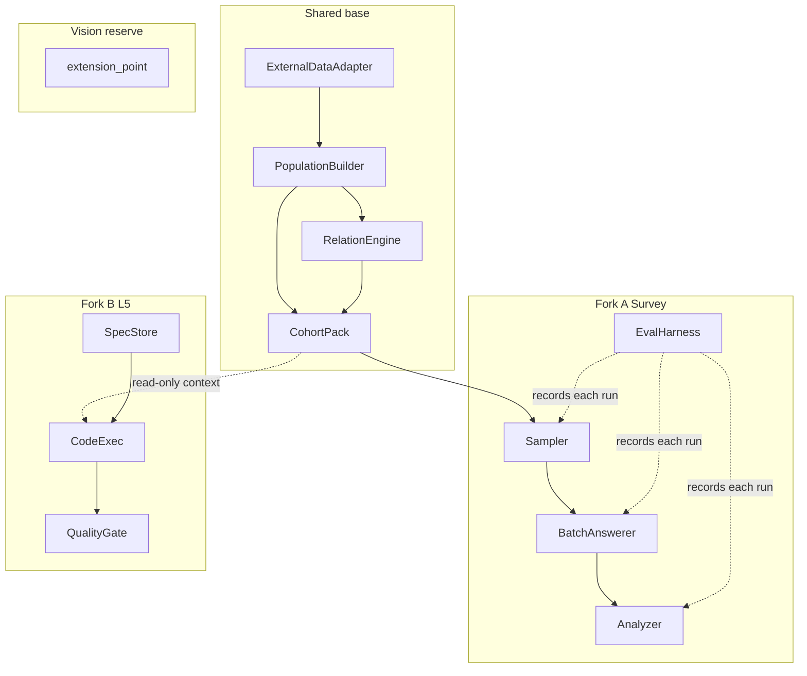

# 架构说明（Phase-1）

| 项 | 内容 |
| --- | --- |
| 状态 | 待外部评审。契约是实现前的接口合同，不是已有代码。 |
| 配套 | 范围与成功标准见 [PRODUCT.md](PRODUCT.md)。顺序见 [ROADMAP.md](ROADMAP.md)。 |
| 编号 | 共享契约 C1–C4，调研 C5–C8，L5 C9–C11。愿景只有接缝，没有契约行为。 |

人口统计评审（产品文档 D1–D12）可以收紧字段和枚举，不应另起一套平行数据模型。

## 1. 形态

一个共享底座，两条产品叉，一处愿景预留。

- **Shared：** 事实、人设、关系、人群包。不包含问卷流程，也不包含写代码的执行器。
- **Fork A Survey：** 抽样、批量作答、分析、评测。依赖底座，不反向把问卷字段写进人设的 `fact` 层。
- **Fork B L5：** 规格、有限工具链执行、验收门。可读人群包，不把人群包变成执行器。
- **Vision reserve：** `extension_point`。以后的产品（包括 MMO-AI 基底）从这里接新的叉，不在 Phase-1 实现。

叉与叉之间不互相调用。调研不调用 `CodeExec`。L5 不调用 `BatchAnswerer` 来「开会写代码」。

## 2. 结构

`EvalHarness` 是调研运行的外壳：它选择基线臂、调用 C5–C7，并强制写出 `RunManifest`。分析模块不负责记账。

## 3. 模块边界

| 模块 | 叉 | 允许读取 | 允许写出 | 边界 |
| --- | --- | --- | --- | --- |
| `ExternalDataAdapter` | Shared | 来源登记项、原始切片 | `FactRecord[]` | 不推断、不生成人设、不访问链 |
| `PopulationBuilder` | Shared | `FactRecord[]`、推断/生成策略、目标框 | 人群框与 `Persona` | 不把非事实标成 `fact`；不画关系边 |
| `RelationEngine` | Shared | 人群或人群包、规则开关 | `Edge[]` | v0 类型仅 `family`、`colleague`；关闭时边集为空或不参与下游 |
| `CohortPack` | Shared | 人群框、包规格 | `Cohort` | 不执行问卷，不执行代码 |
| `Sampler` | A | 人群框或 `Cohort`、抽样设计 | `Sample` | 不调用模型 |
| `BatchAnswerer` | A | `Sample`、问卷、条件（人设，及已启用的边）、模型路由 | `ResponseSet` | 无常驻 Agent，无社会 tick，无 Crew 编排 |
| `Analyzer` | A | `Sample`、`ResponseSet`、权重 | `Analysis` | 不改写 provenance，不补造 `fact` |
| `EvalHarness` | A | 运行配置、自证类型、对照臂 | `EvalReport` + `RunManifest` | 每次运行都落记录，包括失败运行 |
| `SpecStore` | B | 人提交的规格与测试 | `SpecRevision` | 运行开始后本修订不可改 |
| `CodeExec` | B | 冻结规格、只读 `Cohort` 上下文、有限工具 | 可运行产物与执行日志 | 运行中途不接受人工补丁 |
| `QualityGate` | B | 产物、验收测试 | 通过/失败与证据 | 人不能把失败改判为通过 |

## 4. 接口契约

类型用逻辑字段描述。评审后的 schema 必须能表达这些字段和不变量，可以换物理列名，不能换语义。

### C1 `ExternalDataAdapter`

把一份已登记来源的原始切片编译成事实记录。编译可以清洗行列、统一编码、丢掉无法引用的格子。编译不做街道缺失填补，不做人口下推。

**输入**

| 字段 | 含义 |
| --- | --- |
| `source_id` | 来源登记表主键 |
| `raw_slice` | 该次采集的表或文本切片，视为不可信输入 |
| `collected_at` | 我们取得该切片的时间 |
| `geo_scope` | 地理口径，见下 |

`geo_scope` 必填子字段：

| 子字段 | 含义 |
| --- | --- |
| `admin_area` | Phase-1 固定能力范围是杭州市滨江区；记录里仍显式写入 |
| `street` | `西兴` \| `长河` \| `浦沿` \| `滨江区`（区级合计） |
| `population_basis` | 口径名，如常住、户籍。调用方必须填写，禁止默认值 |
| `period` | 统计期 |
| `boundary_vintage` | 边界或资料所使用的区划版本 |

来源登记（adapter 的配套表，不是第 12 个产品模块）至少包含：`source_id`、题名、发布者、locator（表号或页码）、URL（若有）、`collected_at`、许可或公开属性、该来源使用的 `population_basis`。这是「可核验外部数据」在 Phase-1 的全部含义。

**输出：** `FactRecord[]`

| 字段 | 含义 |
| --- | --- |
| `fact_id` | 稳定标识 |
| `metric` | 指标名，如年龄 × 性别结构 |
| `geo_scope` | 与输入口径一致，不允许在记录内改口径 |
| `value` | 数或分布 |
| `unit` | 人、户、份额等 |
| `period` | 统计期 |
| `citation` | `source_id`、locator、`collected_at`、URL |
| `quality_note` | 可选。原文脚注、舍入、与发布者口径有关的限制 |

**不变量**

- 没有 citation 的格子不能成为 `FactRecord`。
- `FactRecord` 上没有 `persona_id`，也没有 provenance 字段；它本身就是事实层。
- 适配器输出不得包含性格、态度、价格偏好。

### C2 `PopulationBuilder`

**输入：** `FactRecord[]`；推断策略；生成策略；目标框（街道集合、逻辑人口 N 的来源指标）。

**输出：** 人群框。

- 框级：所使用的边际、逻辑人口 N、未物化人数、生成策略版本。
- 物化的 `Persona`：`persona_id`，以及属性列表。
- 每个属性：`key`、`value`、`provenance`（`fact` \| `infer` \| `generated`）、`evidence_ids`（指向 `fact_id`；`generated` 可为空，但必须能指向生成策略版本）。

物化时点由本模块掌握。总体框先保存边际、逻辑人口 N 和生成策略，不先落 N 行富属性人设。`Sampler` 在边际（或由边际定义的联合分布）上抽中单位后，回调本模块按抽中的层属性物化这些 `Persona`，并补全该层允许的 `infer` / `generated` 字段。未进入样本的逻辑人口只保留计数。研发包成员按 C4 的包规格另行物化，provenance 规则相同。

**不变量**

- `provenance` 只有这三值。
- `infer` 或 `generated` 在任何序列化、界面和提示词上下文里都不得显示为事实或「真实统计」。
- 无公开锚点的收入、消费、价格敏感度、性格、兴趣，不得标 `fact`（D8 若放宽，必须先改本文）。
- 下推、按比例分配、模型补全发生在本模块，不发生在 C1。
- 属性之间的自洽规则（例如就业状态与职业）属于本模块的生成约束，失败时丢弃或标为冲突，而不是改写来源事实。

### C3 `RelationEngine`

**输入：** 人群框或 `Cohort`；规则集 `{rule_id, enabled}`。

**输出：** `Edge[]`

| 字段 | 含义 |
| --- | --- |
| `edge_id` | 稳定标识 |
| `src` / `dst` | `persona_id` |
| `type` | Phase-1：`family` \| `colleague` |
| `weight` | 该边对下游条件化的强度；关闭规则时下游不得读取 |
| `rule_id` | 产生该边的规则 |
| `provenance` | 边本身的来源，同样禁止把推断边说成事实 |

**不变量**

- 基线臂 `no_social_rules` 必须能关掉全部社会规则：下游看到的有效边集为空。
- v0 不产出社区影响、舆论或组织集体行为。
- 规则关闭时，人设边际保持不变。关系层不反写 `PopulationBuilder` 的属性。

### C4 `CohortPack`

**输入：** 可选的人群框；包规格（`pack_id`、角色枚举、选取规则、协作边是否更密）。

**输出：** `Cohort`

| 字段 | 含义 |
| --- | --- |
| `cohort_id` | 稳定标识 |
| `members` | `{persona_id, role}` |
| `subgraph` | 成员之间的 `Edge[]`，语义同 C3 |

Phase-1 的包：

- **居民包：** 调研抽样的载体，角色可以就是人口属性的视图（街道、家庭阶段等）。
- **研发包：** 固定的小角色表，外加更密的 `colleague` 边。成员是受访者，也是 L5 的只读上下文。成员没有工具权限。人数少，由 C2 按包规格物化，不占用调研抽样名额。

研发包的密度差必须来自显式规则（可指向 `rule_id`），不能靠把研发人设写进 `CodeExec` 的系统提示词里「隐含地更爱协作」。

### C5 `Sampler`

**输入：** 人群框或 `Cohort`；抽样设计（分层、n、权重方案、种子、是否放回）。

**输出：** `Sample`：`sample_id`、单位列表、设计、权重、种子。

**不变量：** 不调用大模型，不发明属性。设计不足以复现时拒绝抽样，不静默改成另一种设计。分层作用在 C2 的框上；抽中单位的 `Persona` 行由 C2 物化。D7 未冻结前，分层维度与 n 是参数，代码不写死「正确样本」。

### C6 `BatchAnswerer`

**输入**

| 字段 | 含义 |
| --- | --- |
| `Sample` | 含权重与人设引用 |
| `instrument` | 问卷标识、题目、选项、版本哈希 |
| `conditioning` | 人设属性（含 provenance）；仅当该次运行启用规则时附带有效边 |
| `model_route` | 模型标识与解码参数。批量作答与少量追问可以走不同模型 |

**输出：** `ResponseSet`：逐单位回答、`model_id`、提示词模板哈希、种子、分模型的 Token 计数。

**不变量**

- 作答单位是抽中的代表性人设（或与之属性匹配、因而可复用的批），不是长期在线的居民进程。
- 无社会 tick，无多 Agent 角色扮演编排，无记忆产品读写。
- 条件化方式是 genagents 式的：给定属性与问卷上下文作答。属性匹配时允许缓存复用，复用必须记入 `RunManifest`。
- 提示词上下文必须携带 provenance，使模型无法把生成属性当成统计事实来引用。分析层仍要再检查一遍典型引用（C7）。

### C7 `Analyzer`

**输入：** `Sample`、`ResponseSet`、设计权重。

**输出：** `Analysis`

- 样本结构（相对抽样设计，而非相对模型发挥）
- 加权后的总体结果
- 至少：街道对比，以及一个人口维度的交叉
- 典型回答：答案 + `persona_id` + 所用属性的 provenance + 可回指的 `fact_id`（若该属性是 `fact` 或由事实推断）
- 业务结论、建议、风险。风险包含：依赖 `infer` / `generated` 的结论、样本过小的格子、与双基线不一致的地方

**不变量：** 分析文案中的「数据表明」只能指向 `fact` 或带证据的 `infer`，并且用词与 provenance 一致。没有数据依据的街道差异必须写成模拟推断。

### C8 `EvalHarness` 与 `RunManifest`

**输入：** 运行配置；自证类型集合；对照臂。

自证类型：

| 类型 | 内容 |
| --- | --- |
| `structure` | 生成结构 vs 引用的 `FactRecord` 边际。距离指标与阈值是参数（D6）。 |
| `consistency_stability` | 角色自洽探针（少量追问）+ 同设计重复运行的汇总结论稳定性（D10）。 |
| `variable_sensitivity` | 一次只改一类业务变量（价格或权益等），记录方向与分人群差异。 |

对照臂：

| 臂 | 含义 | 类别 |
| --- | --- | --- |
| 全开 | 外部事实 + 社会规则开 | 主运行，不是基线名 |
| `no_external_data` | 人群不接地 `FactRecord`，仅生成属性 | 双基线 |
| `no_social_rules` | 同一人群边际，规则全关 | 双基线 |
| `direct_llm` | 不使用构建好的人设，直接询问模型 | 朴素对照 |
| `random` | 在合法选项上随机作答 | 朴素对照 |

契约两臂都记录。Phase-1 验收至少执行一臂，演示默认 `direct_llm`（产品文档第 5.1 节）。

**输出：** `EvalReport`（各证明与各臂的结果、解释）以及每次运行一份 `RunManifest`。失败或中断的调研运行也要有记录，并标状态。

**`RunManifest` 最少字段**

| 组 | 字段 |
| --- | --- |
| 身份 | `run_id`、开始时间、状态、臂 id、自证类型 |
| 版本 | 代码修订（实现存在之后）、规格/问卷哈希、提示词模板哈希、价格表版本 |
| 数据 | `source_id` 列表、`collected_at`、`population_basis`、框 id、逻辑人口 N、物化人数、provenance 计数 |
| 关系 | 规则集哈希、各 `rule_id` 是否启用 |
| 抽样 | 设计、n、种子、权重方案 |
| 模型 | `model_id`、解码参数、种子、缓存命中数 |
| 成本 | 分模型 `tokens_in` / `tokens_out`、`wall_clock_seconds`、`estimated_cost`、模型调用次数 |
| 结果 | 输出哈希、报告定位 |

稳定性自证比较的是汇总结论，不是生成文本的逐字相等。

### C9 `SpecStore`

**输入：** 人编写的规格与验收测试（在运行开始前）。

**输出：** `SpecRevision`：`spec_id`、正文、测试、约束、`frozen_at`。

**不变量：** `CodeExec` 只能读取已冻结的修订。运行中修改规格等于另一次运行，不能算作同一次无人工介入。

### C10 `CodeExec`

**输入：** `SpecRevision`；可选的只读 `Cohort` 上下文（研发包的角色与子图）；有限工具链。

Phase-1 工具链限于：在隔离工作副本里编辑、运行规格声明的命令、执行验收测试。不包含生产部署、不包含任意对外写权限。

**输出：** 可运行产物（小型 Web 应用）与执行日志（命令、退出码、补丁摘要）。

**不变量**

- 该次运行中途没有人工编辑、人工确认或人工重试介入。自动重试若存在，必须是执行器策略的一部分并写入日志。
- 研发 `Cohort` 不是工具调用者，不能被实现成一组编码 Agent。
- 执行器实现选择见 ADR-004：OpenHands SDK，或 SWE-agent / mini。Phase-1 spike 只接其中一条。

### C11 `QualityGate`

**输入：** C10 的产物、`SpecRevision` 里的验收测试。

**输出：** `pass` 或 `fail`，附命令、退出码、测试报告定位。

**不变量**

- Phase-1 的通过 = 隔离环境中验收测试退出码为 0，且规格中的启动命令能把应用跑起来。
- 失败不可由人改判。人可以在**下一次**运行里修改规格，那是新的 `SpecRevision`。
- Gate 是薄包装：测试执行可以借用执行器的环境，判定规则属于我们，不外包给执行器自述「我觉得完成了」。

### 愿景接缝

`extension_point` 在文档和模块图上占位，表示以后可以增加新的叉读取 C1–C4。Phase-1 没有接口方法、没有事件、没有游戏对象。

## 5. 默认技术栈

| 层 | Phase-1 选择 |
| --- | --- |
| 事实、人设、边、运行记录 | SQLite（本地 spike）或 Postgres（共享运行）。边用关系表。 |
| 统计 ETL | 自建轻量编译：原始表 → `FactRecord`。可借鉴 llm-wiki / Karpathy / nashsu 的 compile-to-FactRecord 形态。不引入其整套桌面应用。 |
| 规则 | 自建 `RelationEngine`。 |
| 调研推理 | 批处理、显式模型路由、可记录的缓存、`RunManifest`。 |
| L5 | 一条外部执行器（ADR-004）+ 自建 `SpecStore` 与 `QualityGate`。 |
| 链与记忆产品 | 不部署。 |

模型供应商与模型名属于运行配置，写入 `RunManifest`，不属于架构锁定项。

## 6. 决策记录

已同意的研究结论。状态不再讨论「要不要在 Phase-1 重新评估」，除非评审书面要求改产品范围。

### ADR-001 事实层自建轻量编译

- **决定：** 借鉴 llm-wiki（Karpathy / nashsu）把原始材料编译成结构化记录的方式。我们的记录类型是 `FactRecord`。统计 ETL 自建。
- **结果：** 不引入、不部署该项目的整套桌面应用。多源只是多条 `source_id`，编译器保持薄。

### ADR-002 不采用 wikiskill 一类社会机制

- **决定：** Phase-1 不包含部门集体、dream / growth，以及把社会当作持续演化机体的运行时。
- **结果：** 关系停在 C3 的显式边。没有成长循环要持久化。

### ADR-003 不引入 Mem0、Letta、Zep

- **决定：** Phase-1 人群没有跨运行的长期记忆产品。
- **结果：** 重复运行的稳定性来自抽样设计、种子和 `RunManifest`，不来自记忆回放。

### ADR-004 调研禁用 deepseek-harness；L5 执行器外置

- **决定：** deepseek-harness 不作为调研运行时，也不作为 `BatchAnswerer` 的实现。L5 的 `CodeExec` 采用 OpenHands SDK，或 SWE-agent / mini，外面套我们自己的薄 `QualityGate`。
- **结果：** spike 只集成其中一个执行器（路线图 O5，建议先试 OpenHands SDK）。执行器的内部规划不替代 C9/C11。

### ADR-005 不建完整 MoA 社会运行时

- **决定：** 不实现 mixture-of-agents 的社会 tick 或常驻多 Agent 社会。规则引擎自建（C3）。作答采用 genagents 式条件生成（C6）：人设与问卷上下文进、回答出。
- **结果：** 逻辑人口可以到规划参考规模，模型调用数随样本量而不是随人口规模增长。

### ADR-006 Chainlink 只保留语义

- **决定：** 「外部数据可核验」落实为 C1 的来源登记和 citation。不上链，不部署预言机。
- **结果：** 可信度由引用、口径字段和评审过的来源清单承担。

### ADR-007 自建批处理，不用 Crew 式多 Agent 作答

- **决定：** `BatchAnswerer` 是批处理流水线，不是一组互相对话的角色 Agent。
- **结果：** 成本模型是「调用次数 × 路由」，不是「居民数 × 对话轮数」。

### ADR-008 栈按第 5 节执行

- **决定：** Postgres 或 SQLite，加 ETL，加自建规则；调研走批处理、模型路由和 `RunManifest`；L5 走选定的执行器加上自建规格库与验收门。
- **结果：** Phase-1 不引入图数据库、向量记忆服务或链节点作为前置依赖。

## 7. 实现约束

schema 和任务拆分开始时核对：

1. C1 与 C2 的写入路径分开，推断代码不能插入事实表。
2. provenance 三值在数据库约束和对外 DTO 里都存在，且没有「未知则当事实」的默认。
3. `population_basis` 无默认值。
4. `no_social_rules` 是运行配置，不是另造一套人群。
5. 每次 C8 运行插入 `RunManifest`，与报告同事务提交；报告不能没有记录。
6. L5 工作副本与人群库分离。`CodeExec` 对 `Cohort` 的访问是只读快照。
7. `extension_point` 不产生表、不产生进程。
