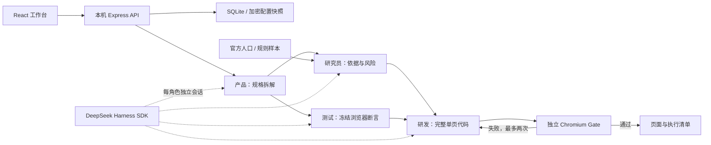

# Demo 实现架构

> F001续作（2026-10-07，本地 `feature/virtual-society-next`，尚未发布/用户验收）：新增单次候选研究规划、业务证据预检、可选五层情景画像、共享凭据脱敏及评委自检/独立启动。五层是独立信息轴，不是DNA因果模型；只进入新2.1问卷的快照/Prompt，不自动更新人口事实或旧2.0证据。具体契约与状态见 [F001设计](prd/F001-society-next/F001-society-next-design.md) 与 [当前唯一计划](SOCIETY-NEXT.md)。本文旧版完整留底于 [原架构](archive/2026-10-07-before-society-next/ARCHITECTURE.md)。

> 2026-10-07增量：`shared/survey-runner.ts`统一浏览器/本机问卷执行，`server/research/surveys.ts`通过Harness，SQLite/IndexedDB存冻结历史；`researchSurveyId`把完成问卷接入四角色并添加不可删的ID、有效分母、合成标记、分组交互Gate。完整记录见[审查补齐](research/AUDIT-FIXES-2026-10-07.md)。旧规则分支仍独立保留，不进入新问卷交付上下文。

按 2026-09-23 用户指示，将执行 Agent 与模拟居民分离。[旧架构与 ADR](archive/2026-09-23-before-demo/ARCHITECTURE.md)留底；旧 C4/C9/C10 和 ADR-004 在当前 demo 中由下文覆盖。

## 1. 数据流

原“双叉互不调用”不再是调度规则：L5 团队可以将城市数据工具作为任务上下文。居民仍是样本数据对象，不拥有工具或开发职责。

2026-09-24 历史增量：新增独立调查工作区与 `ResidentAgentPreset` 配置对象；“居民样本”“人群预设”“研发执行 Agent”三者分离。该阶段尚无居民执行器。2026-10-07已由共享问卷执行器和 `researchSurveyId` 交付衔接替代这个待实现状态；长期自主居民、记忆、dream仍未实施。

## 2. 模块与文件

| 文件 | 职责 |
| --- | --- |
| `src/App.tsx` / `styles.css` | 任务、Agent 配置、城市框、运行与产物展示 |
| `src/ResearchWorkspace.tsx` / `research.css` | `#research` 独立调查编辑、预检、草稿及 `#residents` 人群预设管理 |
| `src/ResidentAgentEditor.tsx` / `QuestionEditor.tsx` | 独立人群/模型配置、五题型编辑；不执行模型 |
| `shared/research-schema.ts` / `src/research-draft.ts` | 前后端共用问卷契约、空白草稿与高级 JSON 输入校验 |
| `server/research/contract.ts` / `residents.ts` | 人口框适用性、严格预设/草稿契约、四类默认情景预设 |
| `server/index.ts` | 输入校验、localhost API、静态入口、产物白名单 |
| `server/store.ts` | SQLite、AES-GCM、不可变快照、实例锁、重启恢复 |
| `server/orchestrator.ts` | 四角色依赖图、状态、结构校验、自动返修、manifest |
| `server/harness.ts` | 实际 dsh SDK 会话、逐角色模型路由、超时和取消 |
| `server/gate.ts` | 声明式浏览器验收、隔离上下文、阻止外部请求 |
| `server/city.ts` | 官方历史人口框、推断联合分层、确定性规则样本 |
| `server/population/model.ts` | RegionPack schema、算术/口径审计、确定性派生、联合人口编译和哈希 |
| `server/population/service.ts` / `scripts/population.ts` | 原件校验、来源白名单、预检/导出API与通用CLI |
| `data/population/` | 官方原件、逐格证据、近期独立观测、区域包与空模板 |
| `src/PopulationExplorer.tsx` | 人口结构、版本、证据追溯、最新区总量与新区域预检 |
| `server/research-cases.ts` / `src/ResearchCaseView.tsx` | 两类任务的适用性、缺口与条件假设；区别工程交付与商业结论 |
| `server/demo-artifact.ts` | 仅 demo 模式使用的显式页面模板 |
| `server/types.ts` | API、Agent、Run、Gate 数据类型 |
| `shared/resident-persona.ts` / `persona-scenarios.ts` | 五层情景契约与无权重探索组合；字段默认未知，资格独立 |
| `src/ResidentPersonaBuilder.tsx` | 五层勾选、连续参数、自定义及收入口径；编辑器按需加载 |
| `server/research/planning.ts` / `shared/research-planning.ts` | 单次有界候选规划；脱敏日志，不自动保存或执行问卷 |
| `shared/business-evidence.ts` | 本地业务来源/观测契约与预检；不抓取URL、不发布人口包 |
| `shared/redaction.ts` / `shared/research-evaluation.ts` | 已知凭据脱敏、账本与计划分母离线评分；自报身份不作认证 |
| `scripts/doctor.mjs` / `launch-review.mjs` | 只读前提检查、明确端口和独立数据目录启动 |

## 3. Harness 决策

采用官方 `@deepseek-ai/dsh-sdk-client@0.1.5-rc.3` 和 `@deepseek-ai/dsh-llm-pi-ai@0.1.5-rc.3`。版本标签对应 commit `a4c74a91e06b00fe0b0937bde982170c526cc842`。

依据：[官方 SDK](https://github.com/deepseek-ai/deepseek-harness/tree/dsh-v0.1.5-rc.3/packages/sdk/client)、[sdk-minimal](https://github.com/deepseek-ai/deepseek-harness/tree/dsh-v0.1.5-rc.3/packages/bundle/sdk-minimal)、[多模型路由](https://github.com/deepseek-ai/deepseek-harness/tree/dsh-v0.1.5-rc.3/packages/llm/llm-pi-ai)。上游仍是 developer preview，因此精确锁定，所有调用集中在 adapter。

每次角色请求启动真实 Harness 会话，通过最小 profile 和 pi-ai 模型路由执行，读取最终回复与 usage，随后关闭。四角色调度、结构化交付和 Gate 属于 City Agent。通过禁用最小 profile 中的 shell/主机工具，模型只能返回结构化文本；宿主按固定文件名写代码，生成代码只在 Chromium 中执行。

暂未出现必须换底层的阻碍。第二选择仍为 OpenHands SDK，但不引入第二运行时；只有 dsh 无法满足已验证的要求时才重新决策。

## 4. 执行契约

- `Agent`：一个角色、一套模型连接。复制包括 Key；对外仅显示 `hasApiKey`。运行选择的四位 Agent 和密钥分别做公共/加密快照。
- `Run.input`：规范化需求、模式、选人、商品、价格、样本数和 seed。配置编辑不改变已有运行。
- `spec.json`：产品产出的目标、范围、四角色任务、验收要点和限制。冻结后提供给研究、测试与研发。
- `acceptance.json`：测试产出的声明式操作及哈希，研发前冻结，返修期间不修改。
- `index.html`：模型完整返回的离线单页程序，或明示 demo 模板；不接收模型指定的宿主路径和命令。
- `GateResult`：实际页面加载、可见正文、JS 错误以及逐条浏览器断言。每项新建页面，不接受模型自述“通过”。
- `manifest.json`：版本、状态、模式、输入/断言/产物哈希、角色快照、Token、调用次数、耗时、返修、数据版本、风险。异常正常收尾也写清单；进程硬退出由 SQLite 记录恢复为 interrupted。
- `population-pack.json`：本次人口数据包完整快照。manifest.population保存包hash和原件hash；构建上下文、样本时若包版本变化则失败，防止静默跨版本混用。后续包更新不覆盖历史运行副本。

允许的测试动作：fill、click、assertText、assertVisible、assertValue、assertChanged。最多 12 个检查，每项最多 20 步；至少一项交互后验证可观察结果。500 KB HTML 上限，单项 5 秒、Gate 总计 60 秒。模型结构校验失败自动重试一次，但不超过整次 12 次调用上限。

## 5. 本机与代码执行边界

新增 `resident_agents(id,data,secret)` 与 `research_projects(id,data)` 表。预设公开 JSON 不含 Key，`secret` 复用 AES-GCM；提供方或地址变化且未明确重填新 Key 时清除旧 Key。草稿仅引用预设 ID，无运行快照或已验证状态；被草稿引用的预设不能删除。后续执行阶段必须冻结问卷、画像、模型配置与证据版本，不能直接把这些可编辑草稿当不可变运行记录。

`POST /api/research/projects/validate` 对问卷及每个人群预设与问卷的 AND 交集分别预检，区域/时期/单位必须相容。返回 `executorAvailable:false`、`modelCalls:0`、`marketResearchValidated:false` 描述该预检路径不执行问卷，不是当前产品没有独立问卷执行器；Key 存在和资格通过互不替代。预设复制只复制配置，不增加任何实际或逻辑人口数量。历史接口详见[工作区交付记录](research/WORKSPACE-2026-09-24.md)。

API 绑定 127.0.0.1，校验 Host 与 Origin，不开放通配 CORS。SQLite owner lock 防止第二服务进程误中断现有运行；服务启动识别已退出进程的未完成工作。

配置加密使用独立 0600 本机密钥文件，快照密钥也加密。Harness 子进程环境仅包含必要 PATH、LANG 和当前模型 Key，不继承其他业务凭证。输出错误脱敏。没有共享租户认证，不面向公网。

运行路径由服务产生且固定，产物下载按登记列表并检查 realpath，阻止目录逃逸和符号链接。生成 HTML 响应携带 CSP `sandbox allow-scripts`，不开放 same-origin、forms、popups 或 connect；前端 iframe 同样限制。验收采用内存虚拟文档+所有网络路由拦截，不执行模型生成的 Node/Python/shell。

这是本机 demo 的受限浏览器执行，不是面向恶意任意代码的容器平台。扩展工具之前应新增进程/容器资源隔离和网络权限设计。

## 6. 城市数据

数据不再写死在city模块：`原件/发布页 → 逐格证据 → RegionPack → 审计/文件完整性 → 24个全龄逻辑单元 → 12层15+通用夹具`。区域包只包含一致的2020普查时点；2023—2025近期观测独立保存，保留万人单位与发布精度。不存在当前街道人口自动外推。

模型按 `independence` 生成明确infer联合频数，或按 `observed` 接受完整观测联合表。确定性减法保留输入观测链，原表与派生列区分。RegionPack哈希覆盖来源元数据、观测与方法；调查manifest含数据包和原件哈希。结构审计不认证发布者、原表转录或统计效度。详见[方法论](population/METHODOLOGY.md)。

人口API包括 `/api/population`、`/pack`、`/model`、`/template`、`/sources/:id` 和POST `/validate`。上传预检不激活，不访问提供的URL；仅读取专用sources目录内合法真实路径。原件下载只允许内置登记来源，验证后以附件返回，HTML不可作为同源页面执行。overview完整性失败返回blocked，前端隐藏模型数字并展示失败来源；模型导出与调查调用失败时拒绝建模。

专用school/pet任务写 `case-report.json`、`data-gaps.json`，不会设置 `run.survey`，故UI不显示通用接受率。底层夹具仅作不适用的追溯附件。live角色也收到needs-data硬约束，研究schema要求保留状态，3条系统交互断言与模型测试一起冻结。它们验证页面行为与状态，不自动判定全部自然语言商业陈述的真实性。

事实来源为[滨江官方统计年鉴](https://zjjcmspublic.oss-cn-hangzhou-zwynet-d01-a.internet.cloud.zj.gov.cn/jcms_files/jcms1/web2945/site/attach/0/87ab83d95bd24748b0747c7ab72bf6ce.pdf)：表 1-2，印刷页 109；表 1-5，印刷页 112。人口口径为 2020-11-01 常住人口，区划为七普街道口径。

抽样采用街道×年龄组（15–59、60+）×性别共 12 个推断层，每层至少一人、余量最大余数分配；权重为层人口/层样本量。seed 驱动确定性合成人设。未模拟真实个体抽样误差。

偏好公式、参数与随机方法在 `survey.manifest` 中公开；价格敏感性使用同一组合成潜变量。人口校准由结构设计保证，价格单调性由公式保证，都不构成市场有效性的独立证据。
