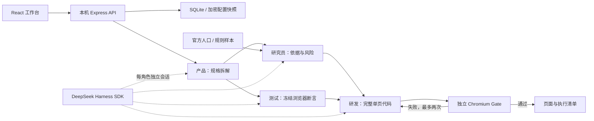

# Demo 实现架构

按 2026-09-23 用户指示，将执行 Agent 与模拟居民分离。[旧架构与 ADR](archive/2026-09-23-before-demo/ARCHITECTURE.md)留底；旧 C4/C9/C10 和 ADR-004 在当前 demo 中由下文覆盖。

## 1. 数据流

原“双叉互不调用”不再是调度规则：L5 团队可以将城市数据工具作为任务上下文。居民仍是样本数据对象，不拥有工具或开发职责。

## 2. 模块与文件

| 文件 | 职责 |
| --- | --- |
| `src/App.tsx` / `styles.css` | 任务、Agent 配置、城市框、运行与产物展示 |
| `server/index.ts` | 输入校验、localhost API、静态入口、产物白名单 |
| `server/store.ts` | SQLite、AES-GCM、不可变快照、实例锁、重启恢复 |
| `server/orchestrator.ts` | 四角色依赖图、状态、结构校验、自动返修、manifest |
| `server/harness.ts` | 实际 dsh SDK 会话、逐角色模型路由、超时和取消 |
| `server/gate.ts` | 声明式浏览器验收、隔离上下文、阻止外部请求 |
| `server/city.ts` | 官方历史人口框、推断联合分层、确定性规则样本 |
| `server/demo-artifact.ts` | 仅 demo 模式使用的显式页面模板 |
| `server/types.ts` | API、Agent、Run、Gate 数据类型 |

## 3. Harness 决策

采用官方 `@deepseek-ai/dsh-sdk-client@0.1.5-rc.3` 和 `@deepseek-ai/dsh-llm-pi-ai@0.1.5-rc.3`。版本标签对应 commit `a4c74a91e06b00fe0b0937bde982170c526cc842`。

依据：[官方 SDK](https://github.com/deepseek-ai/deepseek-harness/tree/dsh-v0.1.5-rc.3/packages/sdk/client)、[sdk-minimal](https://github.com/deepseek-ai/deepseek-harness/tree/dsh-v0.1.5-rc.3/packages/bundle/sdk-minimal)、[多模型路由](https://github.com/deepseek-ai/deepseek-harness/tree/dsh-v0.1.5-rc.3/packages/llm/llm-pi-ai)。上游仍是 developer preview，因此精确锁定，所有调用集中在 adapter。

每次角色请求启动真实 Harness 会话，通过最小 profile 和 pi-ai 模型路由执行，读取最终回复与 usage，随后关闭。四角色调度、结构化交付和 Gate 属于 City Agent。通过禁用最小 profile 中的 shell/主机工具，模型只能返回结构化文本；宿主按固定文件名写代码，生成代码只在 Chromium 中执行。

暂未出现必须换底层的阻碍。第二选择仍为 OpenHands SDK，但不引入第二运行时；只有 dsh 无法满足已验证的要求时才重新决策。

## 4. 执行契约

- `Agent`：一个角色、一套模型连接。复制包括 Key；对外仅显示 `hasApiKey`。运行选择的四位 Agent 和密钥分别做公共/加密快照。
- `Run.input`：规范化需求、模式、选人、商品、价格、样本数和 seed。配置编辑不改变已有运行。
- `spec.json`：产品产出的目标、范围、四角色任务、验收要点和限制。冻结后提供给研究、测试与研发。
- `acceptance.json`：测试产出的声明式操作及哈希，研发前冻结，返修期间不修改。
- `index.html`：模型完整返回的离线单页程序，或明示 demo 模板；不接收模型指定的宿主路径和命令。
- `GateResult`：实际页面加载、可见正文、JS 错误以及逐条浏览器断言。每项新建页面，不接受模型自述“通过”。
- `manifest.json`：版本、状态、模式、输入/断言/产物哈希、角色快照、Token、调用次数、耗时、返修、数据版本、风险。异常正常收尾也写清单；进程硬退出由 SQLite 记录恢复为 interrupted。

允许的测试动作：fill、click、assertText、assertVisible、assertValue、assertChanged。最多 12 个检查，每项最多 20 步；至少一项交互后验证可观察结果。500 KB HTML 上限，单项 5 秒、Gate 总计 60 秒。模型结构校验失败自动重试一次，但不超过整次 12 次调用上限。

## 5. 本机与代码执行边界

API 绑定 127.0.0.1，校验 Host 与 Origin，不开放通配 CORS。SQLite owner lock 防止第二服务进程误中断现有运行；服务启动识别已退出进程的未完成工作。

配置加密使用独立 0600 本机密钥文件，快照密钥也加密。Harness 子进程环境仅包含必要 PATH、LANG 和当前模型 Key，不继承其他业务凭证。输出错误脱敏。没有共享租户认证，不面向公网。

运行路径由服务产生且固定，产物下载按登记列表并检查 realpath，阻止目录逃逸和符号链接。生成 HTML 响应携带 CSP `sandbox allow-scripts`，不开放 same-origin、forms、popups 或 connect；前端 iframe 同样限制。验收采用内存虚拟文档+所有网络路由拦截，不执行模型生成的 Node/Python/shell。

这是本机 demo 的受限浏览器执行，不是面向恶意任意代码的容器平台。扩展工具之前应新增进程/容器资源隔离和网络权限设计。

## 6. 城市数据

事实来源为[滨江官方统计年鉴](https://zjjcmspublic.oss-cn-hangzhou-zwynet-d01-a.internet.cloud.zj.gov.cn/jcms_files/jcms1/web2945/site/attach/0/87ab83d95bd24748b0747c7ab72bf6ce.pdf)：表 1-2，印刷页 109；表 1-5，印刷页 112。人口口径为 2020-11-01 常住人口，区划为七普街道口径。

抽样采用街道×年龄组（15–59、60+）×性别共 12 个推断层，每层至少一人、余量最大余数分配；权重为层人口/层样本量。seed 驱动确定性合成人设。未模拟真实个体抽样误差。

偏好公式、参数与随机方法在 `survey.manifest` 中公开；价格敏感性使用同一组合成潜变量。人口校准由结构设计保证，价格单调性由公式保证，都不构成市场有效性的独立证据。
