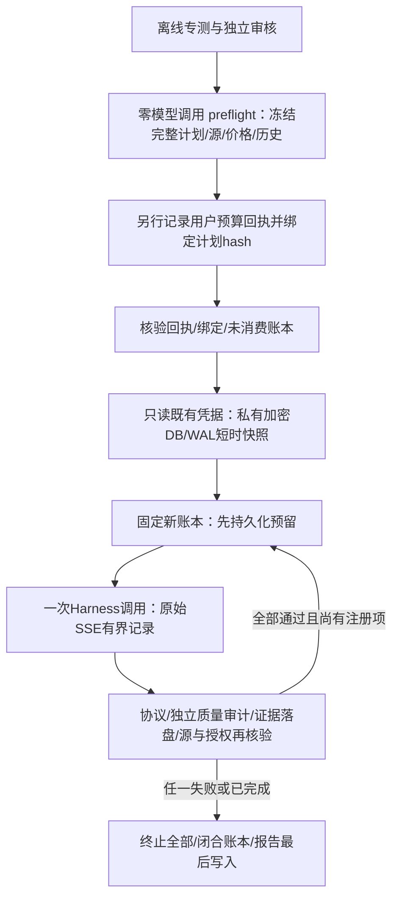

# T28：独立 Responses 真实能力探测设计

> 最新设计增量：注册1.3 / Prompt `resident-object-knowledge-boundary-1.1`。用户已默认授权后续同类≤¥1/≤2独立实验，每轮仍须新ID/回执/冻结计划和账本。原0-call、f3协议失败及143651dd知识边界失败均以完整原件hash封存，不resume、不借旧预留。已提供定义≠已观察到主观理解、居住地≠消费可达资料；最小修复与非作者反证见[知识契约审查](../../research/KNOWLEDGE-CONTRACT-REVIEW-2026-10-08.md)。新实网结果另行登记，以下1.1设计及其追加为历史，不将当时累计授权套到新独立额度。

版本：1.1；日期：2026-10-08；归属 F001 / T28。

1.1增量由用户明确确认「沿用原项目研究院的key」，按上下文执行为原项目已配置研究员Key。原0-call注册完整保留；新注册绑定其hash，并在任何网络/preflight/读取Key前及每个源码门核验旧注册无ledger/lock、观察仍为0请求。新ID不是新增额度，累计仍≤¥1/≤2。凭据目录的规范化绝对路径同时进入计划和回执，CLI只接受同一路径；不复制Key、不启动原库SQLite、不写原库。两次具体问卷/Prompt/schema/model均不变。

用户已明确授权本轮独立预算：≤¥1、≤2次请求。该授权仅覆盖已配置 DeepSeek 固定模型、两场景完整问卷各至多1次；不是恢复旧账本、启动10＋10调查或上线新默认路线的授权。保留原 [预登记草案](../../research/RESPONSES-LIVE-PREFLIGHT-2026-10-08.md) 与旧实验原始记录，不覆盖旧结果。

## 目标与验收

验证完整17题小学生零食、18题宠物零食问卷能否经 DeepSeek Harness SDK 的有界 Responses 候选获得本次合规文本。分别记录 HTTP 接受、流协议/EOF/用量、独立结构 oracle、原业务逻辑、资格和知识缺失审计。任何首份结构、逻辑、资格、未知信息编造、网络、用量、预算、存储、源漂移或取消异常立即停止全部；保留第二场景 `not-started` 分母。

两名输入是固定的合成知识边界角色，不是人群抽样 cohort。只给明确的照护/购买资格和人口属性，不补造现实消费、预算和态度。缺失项必须 typed `unknown` / `null`。完整契约保持 required、enum、多选限额及排他约束；不以删除约束或清洗失败答卷取得通过。

即使两次通过，也只能登记「接口接受及本次生成合规」；关键字强制执行保持 `unknown`，市场偏好、选址正确性和人格增益均不能据此认证。

## 固定执行边界

| 项目 | 固定值 |
| --- | --- |
| provider / base / model | `deepseek` / `https://api.deepseek.com` / `deepseek-flash` |
| 私有上游接口 / HTTP接受 | `https://api.deepseek.com/v1/responses` / 仅200 |
| 最大调用 | 2；每场景1；串行；无规划、CORS、余额或模型列表请求 |
| 输出/期限 | 每次最多3000输出tokens；有界 Harness 90000ms |
| 预算 | 沿用同一用户授权累计≤¥1/≤2次，前继0调用；新ID只冻结来源，不增加额度；完整 UTF-8 body＋1024输入预留；峰值非缓存价 |
| 禁止项 | 重试、补样、换模型、fallback、别名、扩容、重开账本或临时改Prompt/schema |

价格以执行前重新读取的 [官方价格页](https://api-docs.deepseek.com/zh-cn/quick_start/pricing/) 为依据，表格/模型顺序或登记价格变化即0请求拒绝。文档快照与核验时间留存；价格估算不冒称供应商账单。

## 顺序与实现

- `shared/responses-probe-plan.ts`：独立对象答卷Prompt，固定角色和未知边界、两完整问卷、请求字节及独立审计；不复用旧数组Prompt。
- `responses-probe-registration.ts`：严格校验计划/价格/预算回执/计划绑定，重新捕获新增源码与数据；不自造用户授权。
- `probe-credential.ts`：不开原数据库、不迁移/写原存储。只读稳定原文件，在私有临时目录复制加密DB/WAL；校验WAL头/帧/checksum，不将损坏WAL退回旧Key；Key只在内存。SQLite只打开副本，清理后再次核验原文件。
- `responses-probe-run.ts`：先落盘、单次dispatch、原始流字节见证，Harness decoder之外再做独立业务审计；安全完整原文才0600留存，部分流只登记前缀hash，Key回显不留原文。
- `run-live-responses-probe.ts`：只接受 `--preflight` / `--execute` 和可选既有凭据目录；无Key、模型、预算、端点、次数扩权参数。授权/源变更、旧/已消费账本均拒绝。保存阶段性checkpoint、原始SSE、用量与最终报告；账本闭合失败不得登记已完成。

原凭据目录及两份旧closed实验不改。原0-call材料位于 `output/live-evaluation-authorizations/approved-2026-10-08-responses-cny1-2/`；已确认来源的新登记位于同父目录的 `approved-2026-10-08-responses-cny1-2-original-store/` 和新的 `output/live-capability-proof/<UUID>/`，不覆盖历史与离线申报材料。内部原文不自动推送到GitHub；公开版本另做脱敏和单独文件hash。

## 分阶段验收门

1. 工程：专测覆盖授权变更、计数、原文溢出/泄密/缺失、Key读取与清理、首失败全停、存储失败、源漂移和取消；类型、全量回归、独立安全/研究审核通过。
2. 执行前：新计划/回执绑定、价格新鲜、已配置固定模型、未消费账本、源与历史一致；否则0模型请求。
3. 实网：最多2请求，完整实际响应与reported usage核对，按预登记停止。失败也是结果，不能用重试或预期数据替换。
4. 后续：根据本门真实结果决定离线修复或新的受控能力实验；10＋10/关键字因果对照/UI集成需要独立研究计划，不由本轮自动开启。

## 实网后的离线兼容修复：message phase（2026-10-08）

原项目研究员凭据已按用户选择只读使用。新注册 `f3ae4289-85a8-4b34-b8ea-8d0e5a264469` 实际仅转发1次：HTTP200/完整EOF；旧1.0文本见证器在第三个事件以 `unsupported-output-item` 拒绝。独立元数据复核定位到普通assistant message的新增 `phase: final_answer`，不是reasoning/tool输出。首失败后第二场景未启动，账本已halted/闭合。原始失败、usage未知和预留金额永久保留，不以回放结论改写。

本修复只修改离线候选解析器，不改变原冻结请求、问卷、schema、模型、预算或默认API/UI：

- 见证版本升为 `responses-text-stream-1.1`，message只增加可选 `phase`，唯一接受值 `final_answer`；既有三个message均不带phase的轨迹继续兼容。
- 在added阶段绑定phase是否存在，done及completed必须保持同一存在性和值。`commentary`、null、未知值、任一阶段新增/删除/漂移均拒绝；不忽略其它extra字段。
- 仍仅一个assistant message/一个output_text；无reasoning、工具、部分输出或失败终态支持。原有EOF/字节上限/重复属性/事件次序/ID/model/usage/独立答卷校验不放松。
- 先补独立合成phase正反例及Harness链路夹具；不把真实私有原文放入测试夹具。原文单独只读回放，报告标注posthoc而非新实网结果、Schema关键字因果证据或真实偏好。
- 原注册与账本不再可执行；源码变化后必须拒绝旧计划。新的真实验证另需冻结计划及用户授权，不自动消费本轮余量。

离线验收：带/不带phase均全EOF通过；phase值/存在性漂移与未知字段在流切分后仍拒绝且不释放text/usage；SDK有界链路正反例通过；全套单测/浏览器/Responses专项/Pages类型构建、历史hash起止一致；两名独立非作者审查。业务门仍保持「该实网执行失败，宠物未启动；兼容修复尚未在新的真实请求验证」。

## phase1.1独立新预算与复验（用户已确认）

用户明确选择新的≤¥1/≤2请求授权，并要求后续同类小额验证沿用授权直至主任务完成。本次新注册固定ID `approved-2026-10-08-responses-phase11-cny1-2`，不是恢复原已halted账本；本批每场景至多一次、完整问卷与模型/Prompt/schema/期限不变，首异常全停，不重试、不补样、不换模型、不启动10＋10。

原0-call注册仍检查无ledger/lock及观察hash；新增前一真实执行的封存锚：报告/原账本/原件hash、durable/halted/request1、首failed/次not-started、已闭合无lock。全部在任何preflight网络或读Key前验证，并在每个源码门重复核验。前次预留与unknown费用不减记；上一授权的实际1请求仅作历史，不消费或增加本次新的独立额度。

新的计划版本须加入封存锚并绑定新ID、规范凭据源、当前源码/HEAD/价格与另行记录的用户回执。CLI没有扩权参数、不会自签授权。未消费本轮账本门依旧保持。复验结果单独输出新的UUID目录；原f3执行/零调用/旧5次等材料不覆盖，独立新预算默认授权不改变停止规则或替代新计划冻结。
