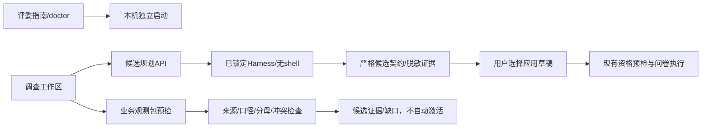

# F001 设计

**对应 PRD**：F001-society-next v1.1（v1.0范围保留，追加五层人群）

规划为独立、显式、有限一次调用；不复用常驻居民历史，不执行模型工具。API只读取被选择的连接，控制面Key不进入公共证据。模型输出必须维持输入人口背景；所有生成声明标记generated或assumption并拒绝事实认证。

业务包导入只接受JSON，不访问包内URL和文件路径，不自动取代人口RegionPack。之后的现实桥MCP只应在经过授权、来源审计及版本化候选发布的前提下扩展。

状态机：idle → requesting → candidate或failed/cancelled；只有用户点击应用才替换编辑草稿。草稿变更后旧预检失效。导航/取消后的迟到响应不得覆盖新任务。

规划、业务证据面板按需加载，沿用现有表单和错误样式；使用有标签文本框、明确调用提示、状态文本、候选限制和下载按钮。网络/系统字体以外不增加装饰性外部依赖。

评委工具不读Key、不初始化用户数据库、不探测付费API；启动可以明确创建独立本地数据目录。Chromium仅工程验收用途，模型调用不是浏览器自动化。

## 五层补充设计

人口地域/时点/街道/年龄/性别是共同统计锚点；人格、成长、教育、家庭、工作/收入是独立情景轴，不组成“DNA→家庭→学历→收入”的因果链。每个预设可以有可选persona，其自身版本1.0、provenance固定assumption；未知用null/unknown/空列表，不默认设置50或区平均收入。

成长中的主要照护结构单选，其余经历多选；当前关系单选，居住和照护职责多选。独居与明确同住互斥，但独居可承担异地照护。收入口径必须与有值范围绑定，人民币/月/个人税前或家庭可支配不可混用。细学历与人格没有匹配的区内统计，不赋予真实权重。

保存/复制保持结构化设定、原有Key隔离和旧数据兼容；新数据才初始化未知五层。Profile冻结persona，运行版本升为coverage-survey-2.1-persona-layers，哈希与完整Prompt包含该字段。no-persona和demographics-only删除该情景字段；旧2.0证据保持原版本和原Prompt可导入，不自动升级结论。

UI提供五个折叠层、具名输入/多选/自定义项目，以及探索组合（无人口占比、人格与收入默认未知）。组合仅替换persona，不更改资格筛选。问卷自证脚本写新的独立运行目录，原稿/原文/统计/成本和模式字段均可追溯；fixture不计真实实验通过。
