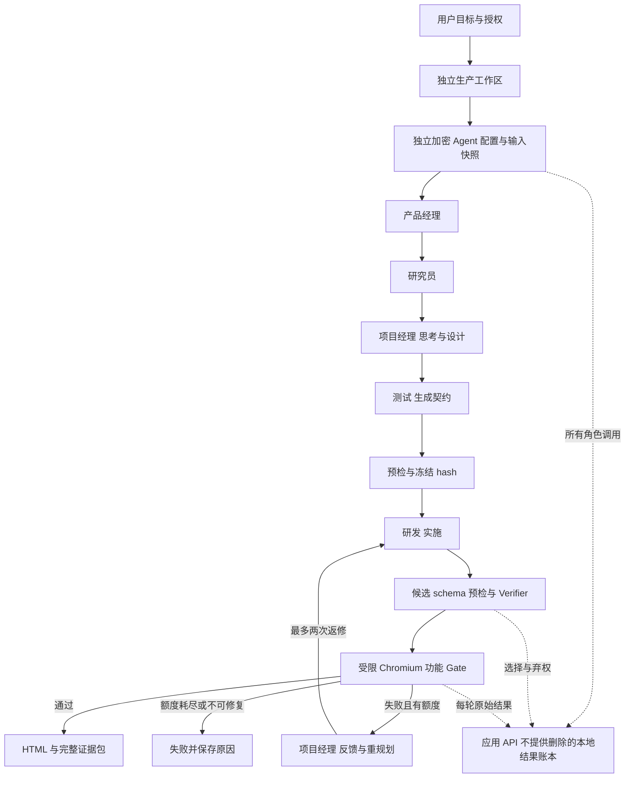

# 六角色自主研发管线设计

本线把一句话软件需求转换为规格、计划、验收、受限应用和证据包。第一批只执行单 HTML 应用，采用 DeepSeek Harness 0.1.5-rc.3 加现有浏览器 Gate；不在宿主执行生成的 Node、shell 或安装脚本。产品实现与既有虚拟社会功能分开，旧四角色契约保持兼容。

## 团队与职责

| 环节 | AI 职责 | 门禁 |
| --- | --- | --- |
| 产品经理 | 扩展用户目标为明确范围、用户故事、非目标与可观察验收 | 结构有效、与原目标一致、不得虚构外部事实 |
| 研究员 | 检查约束、风险、实现选择和待确认条件 | 不将推断当事实，不扩大执行权限 |
| 项目经理 | 分解任务、选择下一步、跟踪测试反馈与有限返修 | 版本化决策、剩余额度、终止态；不修改冻结验收 |
| 测试 | 把验收转成可执行浏览器检查 | 包含交互与结果、合法选择器、研发前冻结并记录 hash |
| 研发 | 根据规格和契约输出完整 HTML，按失败证据修复 | 结构预检、候选验证、禁止主机工具和外部依赖 |
| Verifier | 逐项检查候选、选择本次池中合格者或弃权 | LLM rubric 或 Jev 三维 Score/Noul/Choice；不确定升级 LLM，硬 Gate 不能被覆盖 |
| 确定性 Gate | 实际加载页面、执行操作并记录结果 | Verifier 与项目经理均无权覆盖失败测试 |
| 交付 | 汇总源码、契约、模型与 Prompt 版本、调用及结果 | 失败不伪装成功，未知 usage 和费用不按零处理 |

默认每环节一个候选加一次独立验证；需要选优时可改两个候选，验证所有候选，费用随调用增加。Verifier 自身采用结构与引用校验，不递归调用另一个 verifier。所谓“思考”保存决策摘要和计划，不要求或公开模型内部思维链。

## 架构

图中研发之后的 Verifier 只是展示位置；产品、研究、项目经理和测试的可替换输出也必须经它检查。角色调用与浏览器工具分别计量，不把模型口头“通过”作为执行结果。账本是本地可追溯记录，不是密码学防篡改日志；供应商 HTTP 请求的计量完整性须通过原始流观察验证，不能仅凭 SDK 填补的数字断言。

## 闭环和终止

显式执行“目标分析 → 计划 → 实施 → 测试 → 反馈 → 再计划”。初次研发加最多两次修复，任何阶段均受整次调用、Token、时间与金额限制。缺配置、无法计量费用、取消、超时、验证弃权或超限进入明确终止态，重启标为 interrupted，不自动重放付费请求。

“不卡壳”指最终交付或明确失败，不指无限重试到显示成功。当前闭环不接管任意仓库、不发布服务、不进行外部协调。后续受控仓库模块依赖经验证的容器能力。

## 安全与人类边界

用户负责初始范围、模型配置、授权与最终采用决定。平台开发者负责构建和修复管线；这类外层开发不计内部团队的自主交付。运行开始后不允许人手改产物或放宽 Gate 并仍称无人干预。取消登记实际原因；账本空介入数组只是系统内记录，不能独立证明系统外没有修改。

Key 仅在控制面加密保存，公开 API、Prompt、日志、导出和产物不含 Key；更换 Provider 或端点默认清除旧 Key。所有配置均在本分支新建，不迁移原线配置。HTML 由响应 CSP 和 iframe sandbox 限制外联、弹窗、下载与同源能力；这些限制不是恶意代码的完全安全证明。

## 两个参考项目

[LLM-as-a-Verifier](https://github.com/llm-as-a-verifier/llm-as-a-verifier/blob/8db8a114355a9d7fdf9a8d1d5c87f6aeebd18770/README.md) 提供细粒度标准、候选选优与进度反馈的思路。本批实现结构化 rubric 及三维评价的 Jev 选优，不复现该项目的 score-token logprob 或 tournament 算法。固定合成候选池对照首候选与选中结果，保存失败和额外费用；小样本不证明普遍增益。

[AnyJev](https://github.com/nokia-applied-research/AnyJev/blob/e6efe1233a57ddc8b291eeb206142bcec003d10b/docs/levels.md) 的 typed decision 与能力分级作为下一阶段方向。SDK 尚未接入；其 L0/L1/L2 是决策读出等级，与研发自动化 L4/L5 无关。未来先固定 retry、replan、terminate 等低风险问题，再在支持 logprobs 的模型上验证读出；校准和 hidden-state head 需独立数据及模型能力，不影响硬安全门禁。

## Jev 快速决策层（本批实施）

托管 [TypeSafe Jev](https://docs.typesafe.ai/introduction/coding-agents) 不是生成代码的模型，也不是已经嵌入 AnyJev 本地 SDK。它位于角色生成与实际 Gate 之间：每个候选用覆盖性、内部一致性和受限执行范围三项 Score，范围安全 Noul，加含 abstain 的 Choice；所有问题同一请求批量评估。固定 `jev-1.13.0`，不使用滚动 latest 别名。[API](https://docs.typesafe.ai/api)

Score 采用分布期望 0–4；所有维度 ≥3、分布集中度 ≥0.5、范围概率及 Choice 达到预登记门限才快速接受。明显不合格拒绝；不确定仅在 live 时升级到一次独立 LLM Verifier，混合 Mock-Jev 则明确终止，不虚构深度模型判断。概率、期望、返回模型、候选 ID 与问题全集均校验。集中度不是校准的业务正确率。[Confidence](https://docs.typesafe.ai/confidence)

纯 demo 不收费；`mock-jev` 是夹具生成加真实 Jev 审查，不能算真实自主研发。live 才可由六角色真实生成。三项人工构造的双候选质量对照先冻结源码、测试及阈值，再让 Jev 在不知道 Gate 结果的条件下选优，最后跑全部候选 Gate，记录选择/弃权/失败及相对首候选结果。

控制面保存独立加密 Key，前端提供启用、轮换、清除与脱敏状态；不迁移旧线密钥。供应商调用单次、不自动重试，取消联动 HTTP 和浏览器。Jev 费用与 Token 进入总账本；缺 usage 停止后续调用。官方当前价格为输入 0.042 USD/百万 Token、输出免费，采用配置快照估算，不是供应商发票。[Models](https://docs.typesafe.ai/models)

## 第一批任务与状态

- 六角色配置、复制和脱敏；独立页面和端口。
- 独立生产状态机、候选验证、冻结契约和有限返修。
- 三个显式 MOCK 案例，运行真实浏览器检查；不计真实业务需求或真实模型成功。
- 配置模型后，在首批总额不超过 15 USD、每次不超过 5 USD 的自主安全限额内进行真实调用；这只是管线估算控制，不保证供应商账单。
- 保存七项申报材料、可复现记录、预测区间与实测分列。
- 测试安全反例、取消、重启和虚拟社会回归。

无官方 L4 参考原文时，只按用户操作性定义自评。用户已允许用模拟需求推进，因此材料可作为演示与技术自证草案，但不能声称已满足真实需求申报条款。
