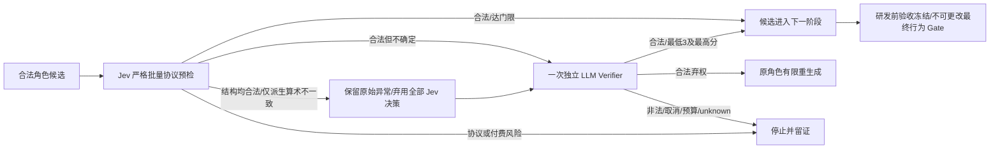

# Jev v3：弃用异常决策、独立复核（实施前契约）

版本v1.0，2026-10-07。授权：用户“进行下一批”，沿用独立生产worktree、真实调用每任务5 USD/总15 USD内部预算和最多2次全局修复。本批最多启动一个新的CAMERA-04真实任务，不自动追第五轮。阶段A限声明式场景/单HTML，不扩权限、不改最终业务Gate。

## 目标

CAMERA-03保留failed。v2的返回score与概率不一致导致正确拒绝，但整个任务无机会由另一个独立判断器验证合法候选。新v3不扩大算术容差，不改供应商原文，不将异常评分当接受依据；只在完整协议结构、标识、模型和已知usage均合规时，把有限的派生算术不一致移交一次独立LLM Verifier。HTTP/鉴权、超时、取消、未知usage、模型漂移、schema/IDs/legend/非法概率等仍停止。

## 状态与证据

- 策略版本升为jev-candidate-v3；旧v2原始证据、预登记和实验不改。
- 数值异常类型仅由可信解析器产生，不匹配模型可伪造的error文字。先预检所有答案，避免第一项算术错误掩盖后续字段/ID/安全协议错误。
- 异常分支必须丢弃全部Jev选优结果；selectedCandidateId=null，无qualified、无隐含“通过”。异常原文/usage仍进入账本。
- 每次Jev评估最多一次独立Verifier升级，不重试Jev。若原角色按全局2次预算重新生成，那是新的候选和评估，不是同一响应无限升级。
- 独立Verifier使用原需求、原候选、当前阶段与冻结Gate事实，不依赖坏Jev分数；评分仍0..5、最低3且选择最高。Jev正常接受的3/4和集中度0.5门限不变。
- 复核占原请求/Token/时间/费用上限；不是额外免费额度或额外返修额度。非法Verifier终止，不能调用第二Verifier追通过。
- 保存独立引擎标识jev-llm-protocol-fallback、触发Jev调用ID、具体诊断，UI明确“异常决策未采信/独立复核”，旧运行字段缺失不回填。
- 实际Verifier调用在请求前登记verificationEngine/sourceJevCallId；传输、未知usage或取消也保留尝试来源，但没有合法模型结论时不虚构评分或弃权。未通过预算预留、根本没发起的请求不伪造调用记录；报告分别导出verifierAttempts与合法verifications。

## 角色输出与业务保持

角色和Verifier请求必须包含由本次实际Zod schema直接导出的版本化JSON Schema，公开每字段类型、数量、长度、范围、额外字段限制；语义refinement不可由JSON Schema完整表达，仍在宿主严格校验。Prompt升新版本，示例不是交付模板；13条acceptance仍拒绝，不能自动删改条目。

各角色须保持原始确定约束（例如用户明确的张掌散开/握拳聚合/横移旋转），不能将平台“允许值”当成可以改用户目标的授权。通用语义守则与阶段评审强化，不能为“圣诞树”添加关键词产物分支。

## 免费验收硬门限

1. 原CAMERA-03响应逐值重放，v3分类为算术异常，原raw不变；旧记录仍failed。
2. 所有答案预检：即使前面有算术异常，后面缺字段/錯ID/改legend/非法概率/错模型/未知usage仍致命，无LLM收费请求。
3. 算术异常→独立Verifier只调用一次；接受仍需合法全部候选评分，弃权走原全局额度；低分、非法协议、unknown、超预算、取消不强迫成功。
4. 反向或none映射不能仅靠schema合法变成业务认可；冻结后不能改变checks/hash。
5. 角色请求中的输出schema与实际结构门禁一致，六角色均覆盖；UI与原始记录分清两种级联。
6. 全量Node、隔离浏览器回归及构建，独立审查、秘密扫描、旧证据/Tag检查通过，再干净提交重建。

真实实验的模型、限额、源码/build/runtime/config版本和所有终态在CAMERA-04预登记/结果另记。工程夹具通过不是内部模型自主交付；场景行为通过仍不等于真实视觉或实体摄像头通过。公开静态Demo/PDF本批不更新。

## 技术来源与局限

- [Jev Score](https://docs.typesafe.ai/primitives/score) 与 [Confidence](https://docs.typesafe.ai/primitives/confidence)：评分与概率分布及集中度的关系是协议核对依据；集中度不是实测业务正确率。
- [Zod 原生 JSON Schema](https://zod.dev/json-schema)：本次使用实际 input schema 的原生导出，拒绝循环/不可表示类型/超限，不维护第二份手写约束。JSON Schema 无法完整表达自定义语义 refinement，宿主与阶段评审仍必需。
- 供应商公开文档不保证本平台采用的两位显示精度。本批延续既有有限容差，不扩大阈值；异常独立复核不是对 Jev 精度、LLM 正确率或成本收益的保证。
