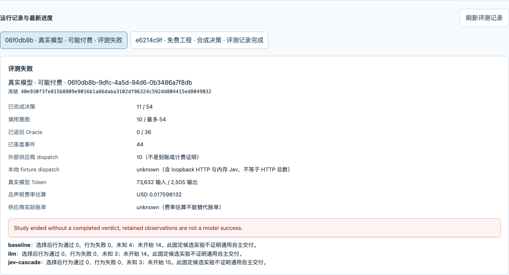

# VERIFIER-REAL-01 — 首次真实对照与协议归因

2026-10-08（UTC+8）。本次唯一授权已消费，运行终态 **failed**；未重试、未恢复、未补写成功。18池的完整配置已执行到H04/LLM协议门禁，不能宣称完成18池对照或模型质量提升。

体验路径：[本机应用](http://127.0.0.1:4420/#production) → 决策设置 → Verifier A/B/C 评测 → 展开评测并测试 → `06f0db8b`。新设备需[安装本生产分支](../../VERIFIER-CONTROL-PLANE.md)，本地私有运行不会自动迁移；没有Key也可只读核验本材料。GitHub Pages仍是固定静态演示/安装入口，不运行本评测后端。

## 1. 冻结与来源

- [预登记](PRE-REGISTRATION.md)、[初稿留底](archive/PRE-REGISTRATION-initial.md)均在本次启动前提交；补正了已有arithmetic-drift升级分支，并预先固定质量/费用判定。不改运行策略。
- clean源码：`aaaac613cea5c15b3ba0a546457a7eb96e3fd936`；执行源码46项hash与完整工程验证的`eb83022`一致（之后仅文档提交）。SDK保持`0.1.5-rc.3`。
- 控制面ID：`06f0db8b-9dfc-4a5d-94d6-0b3486a7f8db`；原生ID：`3f0a88a8-b767-49c0-80d0-71a405e7b533`。
- freeze：`40e930f3fe815b8809e9016b1a86daba3102df86324c592dd804415ed8049032`；boot：`2be44482-53c5-416c-9c17-16e2694f5d32`。
- [独立授权与全plan](control/consent-consumed.json)、[先行running](control/running.json)、[终态](control/terminal.json)、[终态确认](control/terminal.confirmed.json)均保留原字节。没有复制加密主密钥、状态库或API Key。
- 页面实操启动；DeepSeek官方地址、`deepseek-flash`，输入0.30/输出1.20 USD/百万Token；Jev `jev-1.13.0`，输入0.042/输出0，门限0.5/3。7次LLM未记录响应Model ID，标unknown；3次Jev响应Model ID匹配。不宣称权重固定或跨模型独立性。
- 54决策/最多54调用意图，零重试，30分钟停止触发、1USD声明价估算停止额度；Jev输出4096仅事后观测。采样参数按供应商默认/unknown，候选未随机。估算不是供应商账单硬上限。

## 2. 完整性与实际执行

内核：`2026-10-07T16:53:11.986Z`至`16:53:55.861Z`，**43.874秒**。控制面创建至终态45.531秒；二者不混用。

44事件、44原目录scope确认marker、1manifest，共89个ledger JSON。授权/running先于调用；10个不同intent逐一有result，每次记录1次HTTP POST、HTTP200、`cleanupAwaited=true`。这是原生观测证据，不等同独立OS进程清点或供应商账单。失败后没有新调用。

54计划决策中11已尝试，**43未启动**；36计划Oracle中**0启动**。盲决策阶段停止，全部已接受选择的实际行为质量仍unknown；旧准备标签不能填充本次Oracle。所有调用用量已知，但未调用部分不补零Token/成功。

| 策略 | 计划 | 尝试 | 接受 | 弃权 | 协议错误 | 未启动 | 接受后的Oracle unknown |
| --- | ---: | ---: | ---: | ---: | ---: | ---: | ---: |
| A 首候选 | 18 | 4 | 4 | 0 | 0 | 14 | 4 |
| B LLM | 18 | 4 | 3 | 0 | 1 | 14 | 3 |
| C Jev级联 | 18 | 3 | 3 | 0 | 0 | 15 | 3 |

“接受”不是良品；好选中率、坏放行率、正确弃权率及高性价比判定 **unknown**，不是0%的实测准确率。本次不进入自主软件交付良品分子。

## 3. 用量、费用与配对比较

| 策略 | 输入Token | 输出Token | 声明价估算USD | 决策区间合计 |
| --- | ---: | ---: | ---: | ---: |
| A | 0 | 0 | 0（仅模型调用） | 0.087秒 |
| B（4次） | 26,916 | 1,137 | 0.009439200 | 17.398秒 |
| C（3次，含全部升级） | 46,716 | 1,368 | 0.008158932 | 21.371秒 |
| 总计 | **73,632** | **2,505** | **0.017598132** | 内核43.874秒 |

引擎拆分：7 LLM＝47,186/1,943 Token、0.016487400USD；3 Jev＝26,446/562 Token、0.001110732USD。H04失败调用0.002385USD已计入；10/10用量完整、unknown调用0。供应商实际账单、外层开发Agent消耗和机器成本仍unknown，不填零。

C升级3/3＝100%，其中arithmetic-drift两次、uncertain一次，直接决策0/3。分母不是18。

同样H01–H03，B为0.007054200USD/13.128秒；C为0.008158932USD/21.371秒，增加**15.6606%费用、62.7895%决策耗时**。计时包含本机冻结、落盘和适配器开销，不是纯供应商延迟。不能将C三次与B四次总费用比较来宣称省费；没有Oracle也不能证明质量相等。

## 4. 可复现归因与18池账本

H04，event42保留完整原响应：理由字符串内的`toFixed(2)+" °F"/" °C"`包含未转义双引号。现有严格解析器在位置238（column239）拒绝，未进入评分/最高分选择；event43记录protocol error，event44结束。响应文本SHA256为`a3db2e3e85211a67000dee4b2a3d96e1968b4ac6ec9a871a61c4aa27c437b170`。HTTP200、wire可见json_object、用量完整不保证响应文本合法；不是截断、选择器冲突或执行Gate失败。原泛化错误提示没有区分JSON语法与评分契约，属于下一批诊断改进。

H01/H02的Jev原响应在本机固定数值协议下发生arithmetic-drift；H03为合法uncertain。免费纯内存重放复现全部状态，没有新增网络请求。官方说明Score是概率加权值，confidence从分布导出且不等于业务正确率；两位展示精度不是官方保证，故本材料称“当前冻结兼容假设冲突”，不断言供应商内部bug。[API](https://docs.typesafe.ai/api)、[Confidence](https://docs.typesafe.ai/confidence)（2026-10-08读取）。

另有独立静态反例：H02候选`cand-7ab2`代码使用`total>100`，但需求是含100元即九折；B与C的LLM理由仍选它并打5/5。源码条件在100元时不成立，是需求/代码/解释之间的静态矛盾，**不是本次已执行的Oracle失败**。仅修JSON不能证明评审正确，最终行为Gate必须保留。

| 池 | A | B | C | 本次Oracle |
| --- | --- | --- | --- | --- |
| H01 | 接受cand-f15c | 接受cand-f15c | 同选择，算术偏差升级 | 未启动/unknown |
| H02 | 接受cand-7ab2 | 接受cand-7ab2 | 同选择，算术偏差升级 | 未启动/unknown |
| H03 | 接受cand-3e91 | 接受cand-80c4 | 同B，不确定升级 | 未启动/unknown |
| H04 | 接受cand-49fe | JSON协议错误 | 未启动 | 未启动/unknown |
| H05 | 未启动 | 未启动 | 未启动 | 未启动/unknown |
| H06 | 未启动 | 未启动 | 未启动 | 未启动/unknown |
| H07 | 未启动 | 未启动 | 未启动 | 未启动/unknown |
| H08 | 未启动 | 未启动 | 未启动 | 未启动/unknown |
| H09 | 未启动 | 未启动 | 未启动 | 未启动/unknown |
| H10 | 未启动 | 未启动 | 未启动 | 未启动/unknown |
| H11 | 未启动 | 未启动 | 未启动 | 未启动/unknown |
| H12 | 未启动 | 未启动 | 未启动 | 未启动/unknown |
| C13 | 未启动 | 未启动 | 未启动 | 未启动/unknown |
| C14 | 未启动 | 未启动 | 未启动 | 未启动/unknown |
| C15 | 未启动 | 未启动 | 未启动 | 未启动/unknown |
| C16 | 未启动 | 未启动 | 未启动 | 未启动/unknown |
| C17 | 未启动 | 未启动 | 未启动 | 未启动/unknown |
| C18 | 未启动 | 未启动 | 未启动 | 未启动/unknown |

## 5. 核验、体验与下一步

[完整原生账本](run-ledger.tar.gz) SHA256：`3d1b81adcbe78a523ee8d442204e79bf704a3e3a8b1b6f58c439a111c654920c`。180原生tar headers＝89ledgerJSON＋1目录＋90PAX，无AppleDouble。

在安装依赖的生产分支clone根目录，无需Key：

```sh
npx tsx scripts/inspect-production-verifier-study.ts --archive docs/production/experiments/VERIFIER-REAL-01/run-ledger.tar.gz --sha256 3d1b81adcbe78a523ee8d442204e79bf704a3e3a8b1b6f58c439a111c654920c
```

结果应为`archiveVerified=true`、`terminalStatus=failed`、44事件/11决策/10意图/0Oracle、完整已知费用；不解压、不重放、不修复、不读取Key。字节完整性不是可信签名或正确性证明。

独立代码/安全审查核对原scope链、全冻结plan/授权/确认、调用和费用一致，无新增未关闭P0/P1/P2；清理结论仅限于原生awaited记录。[本批工程验证](../../BATCH-VERIFIER-CONTROL-CHECKS.md)为676/676 Node＋45/45浏览器，不冒充真实评审成功。

下一批先免费实施：区分JSON语法/结构/评分诊断；新版本紧凑Verifier输出及转义正反例；保留H02含100边界反例和全部坏候选弃权；核对Jev数值协议的兼容前提并重放原响应。不能就地修复模型JSON、放宽评分/最终Gate或重试本次授权。新付费实验需新配置版本/预登记/预算确认，再回到真实HTML需求闭环。


