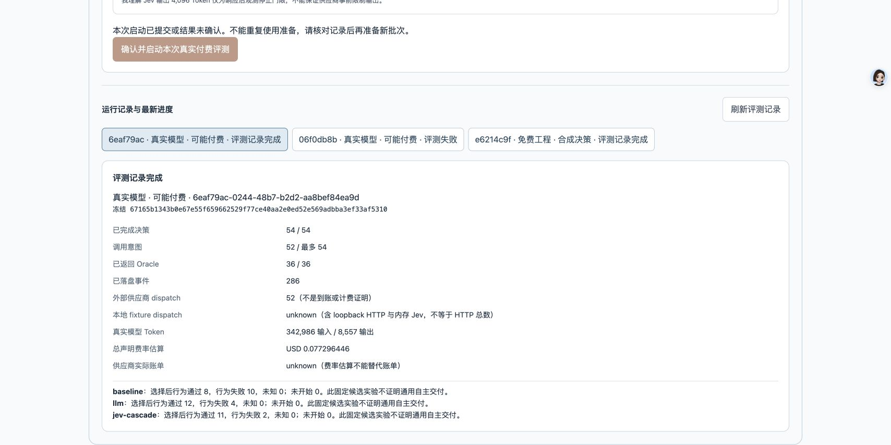

# VERIFIER-REAL-02 — 完整真实对照与质量／成本权衡

2026-10-08（UTC+8）。用户批准的一次实验已完成；没有重试、追加运行或中途改动配置。**54/54 盲决策、36/36 实际行为 Oracle、52 次供应商 HTTP；370.649 秒，声明价估算 0.077296446 USD。** 供应商实际账单仍 unknown。

结论：B（纯 LLM）好选中 12/18、坏放行 4/18；C（Jev 级联）好选中 11/18、坏放行 2/18，费用比 B 高 3.258721%。C 减少坏放行，但覆盖降低且未省费，**不满足预登记的“本样本高性价比”条件**。completed 只代表评测流程完成，不代表自主软件交付、稳定通用 L4/L5 或实体摄像头验收通过。

体验：[本机生产工作区](http://127.0.0.1:4420/#production) → 决策设置 → Verifier A/B/C 评测 → 展开评测并测试 → 选择记录 6eaf79ac。新设备按[控制面／安装说明](../../VERIFIER-CONTROL-PLANE.md)启动；本机配置与私有数据不会随 Git 自动迁移。没有 Key 也能按第 6 节只读核验本材料。GitHub Pages 是固定静态演示及安装入口，不执行新评测或研发任务。

## 1. 先行冻结与实际配置

- [预登记](PRE-REGISTRATION.md)先提交、推送，再构建并由实际页面启动。本次唯一授权已消费，不沿用 REAL-01 授权。
- 实验 clean HEAD：7899b9792dc611f30958a085908add660f3b156d。47 项执行源码 SHA 与已验证修复提交 7345fdaaca5d5f9f89d68911781e1715141fc979 逐项相同；其间只新增预登记文档。
- 工程基线为 705/705 Node、45/45 浏览器、TypeScript/Vite 通过，详见[上一批完整工程记录](../../BATCH-VERIFIER-PROTOCOL-CHECKS.md)。本批不把该历史工程数字称为重新执行的回归。
- 控制 ID：6eaf79ac-0244-48b7-b2d2-aa8bef84ea9d；原生 ID：1766a3be-fbd4-4217-894f-350a68a06d66。
- freeze：67165b1343b0e67e55f659662529f77ce40aa2e0ed52e569adbba3ef33af5310；boot：1d361474-e7d2-4735-adee-e069cccef563。
- Verifier：页面已配置的启用 Agent cc18586a-8d6b-4c19-950f-308034a0c0b1；DeepSeek 官方地址 https://api.deepseek.com，请求 Model ID 为 deepseek-flash；输入／输出声明价 0.30／1.20 USD 每百万 Token。34 次原生观测的返回 Model ID 为 null，不能声称已核验响应型号或底层权重。
- Jev：请求／返回 Model ID 均记录为 jev-1.13.0；输入／输出声明价 0.042／0 USD 每百万 Token。minConfidence=0.5、minScore=3、单次 30 秒，数值容差 ±0.005 保持不变。
- 固定 18 池、每池两候选；候选、Oracle、最低评分及最高分选优规则不变。A 首候选／B 独立 LLM／C typed Jev 及冻结升级策略；v5 ordinal、compact v2、diagnostic v1、strategy v2、source v3。
- 每次独立会话、答案缓存 bypass；全部盲决策先于 Oracle。不向模型提供本次 Oracle、静态好坏标签或另一策略的回答。B/C 升级请求相同但回答来自新调用，不假设二者相同。
- 计划最多 36 LLM＋18 Jev，零重试；30 分钟取消触发、1 USD 声明价停止额度。LLM 请求 max_tokens=4096；Jev 4096 仅为响应后观测门限，供应商输出硬上限 unknown。估算停止不是供应商账单硬上限。
- Key 继续留在加密控制面；外层整理 Agent 未读取 Key，控制面仅按本次授权受控解密并发送给配置的供应商，未回显或迁移到 Prompt／Git／生成项目。候选顺序未随机；温度、top_p、seed 未显式指定，供应商默认／unknown。

## 2. 过程完整性

内核区间：2026-10-07T19:12:01.476Z 至 19:18:12.127Z，manifest 记录 **370,649 ms**。控制创建至终态为 19:12:00.183Z 至 19:18:12.643Z，372.460 秒，二者不混用。

286 事件、286 原 scope 确认 marker、1 manifest，共 573 个 ledger JSON。独立同意消费／running 先于供应商 dispatch；52 个调用意图均有对应结果，各观察到一次 HTTP，34 LLM＋18 Jev。54 决策全部结束于 event213；第一次 Oracle intent 为 event214。36 候选均实际执行隔离 Chromium／场景行为 Oracle，healthy=true：16 好、20 坏，12 池含好候选、6 池全部坏。

| 策略 | 计划／尝试 | 接受 | 弃权 | 终止型决策错误 | 未启动 |
| --- | ---: | ---: | ---: | ---: | ---: |
| A 首候选 | 18／18 | 18 | 0 | 0 | 0 |
| B LLM | 18／18 | 16 | 2 | 0 | 0 |
| C Jev 级联 | 18／18 | 13 | 5 | 0 | 0 |

取消、超时、unknown usage 均 0。**12 次 Jev arithmetic-drift 原始诊断仍保留**，依冻结规则升级一次 LLM；不能将“终止型决策错误 0”解释成所有供应商响应均协议合格。4 次合法 uncertain 另列为升级原因。

52 项调用记录均为 cleanupAwaited=true；这只证明观测适配器记录了等待清理，不等同独立 OS 残留进程审计或供应商已取消。终态已持久化并有确认；重启不恢复付费执行。

## 3. 实际质量与费用

主分母固定为每策略 18 个计划池。正确弃权分母为 6 个全坏池；错弃权分母为 12 个含好候选池，不通过过滤弃权提高“良品率”。

| 策略 | 好选中／18 | 坏放行／18 | 弃权 | 正确弃权／6 | 错弃权／12 | HTTP | 输入 Token | 输出 Token | 声明价 USD |
| --- | ---: | ---: | ---: | ---: | ---: | ---: | ---: | ---: | ---: |
| A | 8 | 10 | 0 | 0 | 0 | 0 | 0 | 0 | 0（仅模型费） |
| B | 12 | 4 | 2 | 2 | 0 | 18 | 115,538 | 2,806 | 0.038028600 |
| C | 11 | 2 | 5 | 4 | 1 | 34 | 227,448 | 5,751 | 0.039267846 |
| 总计 | — | — | — | — | — | **52** | **342,986** | **8,557** | **0.077296446** |

C 引擎费用拆分：

| 引擎 | 调用 | 输入 Token | 输出 Token | 声明价 USD |
| --- | ---: | ---: | ---: | ---: |
| Jev | 18 | 123,413 | 3,356 | 0.005183346 |
| 升级 LLM | 16 | 104,035 | 2,395 | 0.034084500 |
| C 全部 | 34 | 227,448 | 5,751 | 0.039267846 |

52/52 usage 完整；独立逐调用按非缓存保守声明价复算，与原账本浮点值一致（展示保留 9 位小数）。unknownCalls=0 不表示账单已知；供应商实际费用、外层开发 Agent Token／费用及机器成本仍 unknown。

C 比 B 贵 **0.001239246 USD／3.258721%**。预登记要求 C 好选中不低于 B、坏放行不高于 B、完整费用低于 B；本轮仅第二项满足，故 highValue=false。辅助接受后正确比例 A=8/18、B=12/16、C=11/13，不替代固定分母结论，也不能将 C 的 84.62% 接受后正确比例冒称总体成功率。

## 4. 逐池结果与归因

P／F 是本次实际 Oracle，短 ID 省略 cand- 前缀。“弃权”没有选中代码。完整逐调用费用与事件索引见[独立派生指标](metrics.json)，不以本表替代原始事件。

| 池 | 候选1、2 Oracle | A | B | C | C 分支 |
| --- | --- | --- | --- | --- | --- |
| H01 | f15c:P,62d8:F | f15c | f15c | f15c | drift → LLM |
| H02 | 7ab2:F,d90e:F | 7ab2 | 7ab2 | d90e | drift → LLM |
| H03 | 3e91:F,80c4:P | 3e91 | 80c4 | 80c4 | drift → LLM |
| H04 | 49fe:P,ac26:P | 49fe | 49fe | ac26 | drift → LLM |
| H05 | 6b07:F,c8a3:F | 6b07 | c8a3 | 弃权 | drift → LLM |
| H06 | e5d2:P,19f4:F | e5d2 | e5d2 | e5d2 | drift → LLM |
| H07 | 28c5:P,a760:P | 28c5 | 28c5 | 28c5 | drift → LLM |
| H08 | 73de:F,4b81:F | 73de | 73de | 弃权 | drift → LLM |
| H09 | e105:F,6f92:P | e105 | 6f92 | 6f92 | drift → LLM |
| H10 | 90ac:F,2d47:F | 90ac | 90ac | 90ac | uncertain → LLM |
| H11 | c38e:P,51b4:P | c38e | c38e | 51b4 | drift → LLM |
| H12 | 8fa2:P,36d9:F | 8fa2 | 8fa2 | 8fa2 | drift → LLM |
| C13 | f732:F,20c6:P | f732 | 20c6 | 20c6 | uncertain → LLM |
| C14 | 57de:F,aca4:F | 57de | 弃权 | 弃权 | Jev 直接弃权 |
| C15 | d180:P,6ac9:F | d180 | d180 | d180 | uncertain → LLM |
| C16 | e409:P,184f:P | e409 | e409 | 弃权 | Jev 直接弃权 |
| C17 | 61fb:F,834c:F | 61fb | 弃权 | 弃权 | drift → LLM |
| C18 | 9ec2:F,510b:P | 9ec2 | 510b | 510b | uncertain → LLM |

### 边界错误仍需行为 Gate

H02 两份候选均未通过本次实际行为 Oracle；B 接受第一份、C 升级后接受第二份。H10 同样两份均坏且 B/C 接受第一份。通用边界提示没有消除语义误判；模型评分／解释不能覆盖真实业务断言。本次没有人工修正候选、删测试或降低 Gate。

H04 不再因旧 JSON 语法问题终止，完整集得以继续；但这是新配置一次观察，不证明提示的因果收益或稳定成功率。REAL-01 的失败原件不修改、不与本次合并为固定配置重复实验。

### Jev 直接率、升级率与错弃权

Jev 直接决策 **2/18＝11.11%**，两次均弃权：C14 正确，C16 错误。升级 **16/18＝88.89%**，其中 12 arithmetic-drift、4 uncertain。全部升级 logical／wire 请求均与对应 B 相同，但为独立的新调用。H05/H08 的额外正确弃权来自升级 LLM，不能归因于 Jev 直接识别。

C16 原 typed event188：Noul 概率 0.94／0.95，未触发范围拒绝；两候选三维 Score 分别为 2.22／2.39／2.44 与 2.33／2.59／2.59，confidence 为 0.21／0.15／0.13 与 0.07／0／0。两候选 qualified=false、stronglyRejected=false；Choice=abstain、confidence=0.55，触发冻结的“无 qualified＋高浓度 Choice 弃权”分支。event189 记录弃权，实际 Oracle event275／277 均通过。不能把 Choice confidence 当作业务正确率，也不据此推测供应商内部原因。

12 drift 只能表述为现冻结数值兼容假设与真实响应不一致；保留数值原文和诊断，不放宽 ±0.005 来追认通过。是否需要显式适配应继续以公式、精度来源和独立反例审查，不凭本轮结果后验修改规则。

## 5. 原始证据与独立审查

- [一次同意消费与全 plan](control/consent-consumed.json)、[先行 running](control/running.json)、[终态](control/terminal.json)、[终态确认](control/terminal.confirmed.json)：从指定本次控制目录保留原字节，4/4 hash 与原件相同；没有复制状态库／主密钥。
- [原生账本压缩包](run-ledger.tar.gz)：573 ledger JSON；1148 tar headers＝573 JSON＋1目录＋574 PAX，无 AppleDouble。
- 归档 SHA256：8dac4a031c2f289f2d0bd2893eeeb0294890ae2eefb85c43a2f1cf7f81c7ed28。
- manifest 原字节 SHA256：ec75ed83a7f37d94b365a3a9a87a9ad581f98fd3019e5b4874a2d2b3ed7dcb73。
- [只读核验输出](archive-inspection.json)与[指标派生文件](metrics.json)分列。指标从本次 call-result／decision-result／oracle-result 重算，不用研究者静态标签补作 Oracle。
- 独立质量／费用、服务／安全、历史教训三个审查视角核对先行持久化、确认链、源码、盲决策时序、费用及错弃权，没有发现本轮证据实质 P1/P2 矛盾。文档／秘密扫描结果不作完备安全承诺。
- 字节 hash／确认链不是外部可信签名，也不证明模型解释正确。52 次 HTTP 为平台原生观测，不等同供应商账单或底层权重认证。
- 原 REAL-01 压缩包 SHA 仍为 3d1b81adcbe78a523ee8d442204e79bf704a3e3a8b1b6f58c439a111c654920c；原 Tag、主线及 GitHub Pages／旧申报资产保持不变。

## 6. 无 Key 跨设备核验

在安装依赖的生产分支 clone 根目录，使用 Node 22.19+：

~~~sh
npx tsx scripts/inspect-production-verifier-study.ts --archive docs/production/experiments/VERIFIER-REAL-02/run-ledger.tar.gz --sha256 8dac4a031c2f289f2d0bd2893eeeb0294890ae2eefb85c43a2f1cf7f81c7ed28
~~~

预期 archiveVerified=true、terminalStatus=completed、286 事件／54 决策／52 调用意图／36 Oracle、完整 usage 和 0.077296446 USD 声明价估算。该命令不解压、不恢复／重发收费请求、不修复原证据、不读取 Key。派生质量需结合本次 Oracle 事件与 metrics.json，不以归档完整性直接证明业务通过。

## 7. 边界与下一步

这是固定有限、已用于开发的 18 池挑战集，一次完整对照；候选顺序未随机，模型默认采样未知，B/C 使用独立响应。不能外推到未见软件需求、稳定性、通用模型优劣或单独归因于 Jev。选优好坏、软件生产最终交付和实体手势功能是三种验收，分别留证。

下一批优先不收费工作：

1. 从 H02／H10 坏放行建立通用“需求条款 → 实施位置 → 可证伪边界”证据合同及反例，保留最终行为 Gate；不新增题目关键词专用分支。
2. 对 12 次 Jev 数值兼容诊断和 C16 错弃权做离线重放／规范核对；精度及置信度校准与类型合法性分开，只有有来源的新兼容契约才能开启新版本，不后验放宽本次门限。
3. 再回到现有 HTML 生产闭环。任何新的收费验证都先提出新冻结配置、调用／时间／Token 限额与预算，不由本次 completed 自动启动。
4. 受控仓库和容器执行器仍按独立安全门限推进；没有隔离环境不在宿主执行生成脚本。未见泛化与九次稳定性另行预登记。

本批只增补本分支证据／文档，不改执行源码、已提交申报原稿、公开 v5 或另一研发线。运行期间无人改候选／测试／Prompt／费率；外层平台研究与资料整理不是内部 Agent 自主软件交付。
